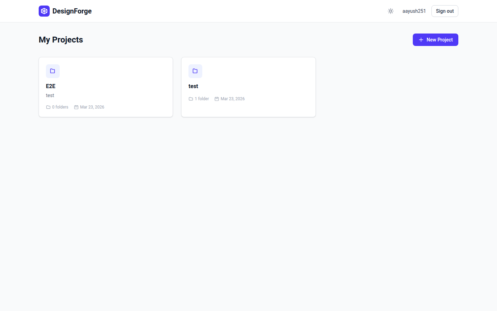
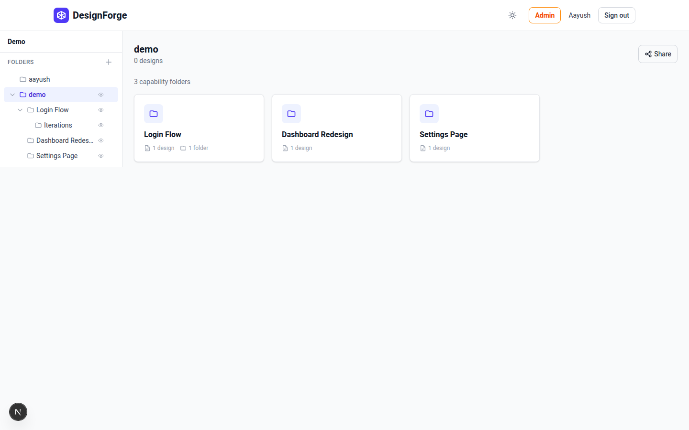
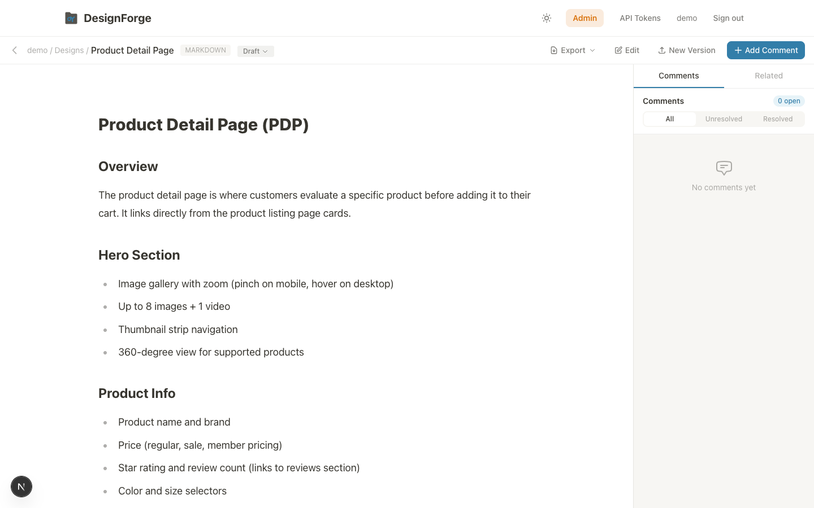
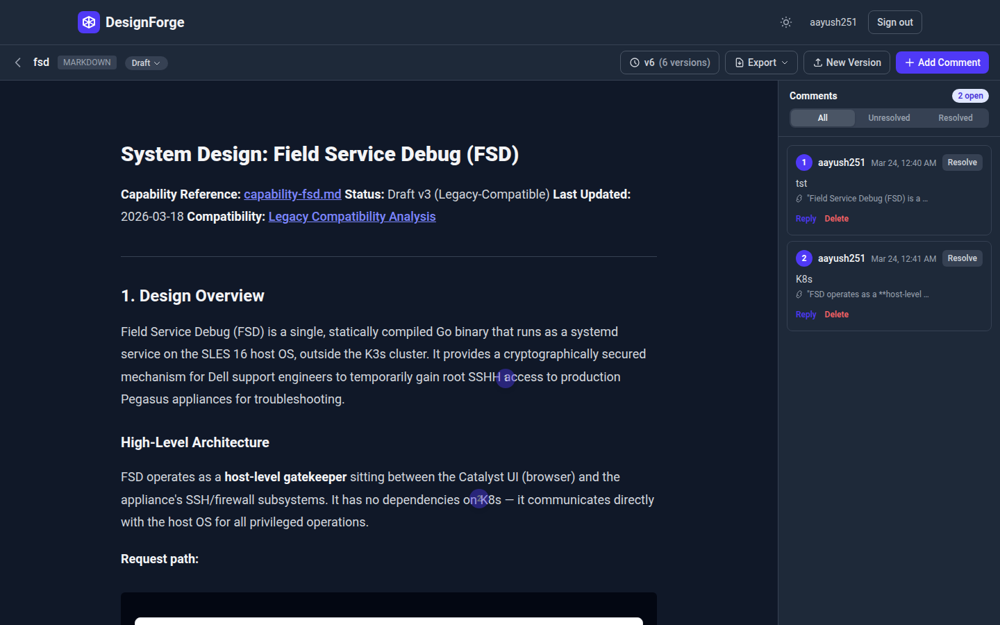
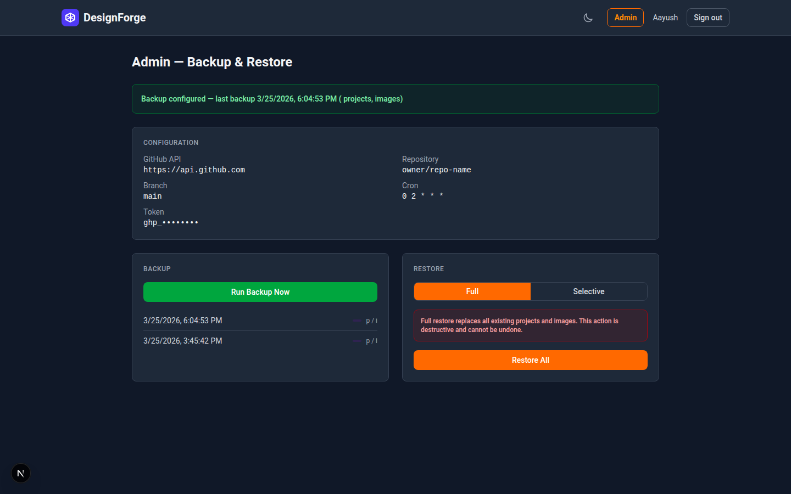
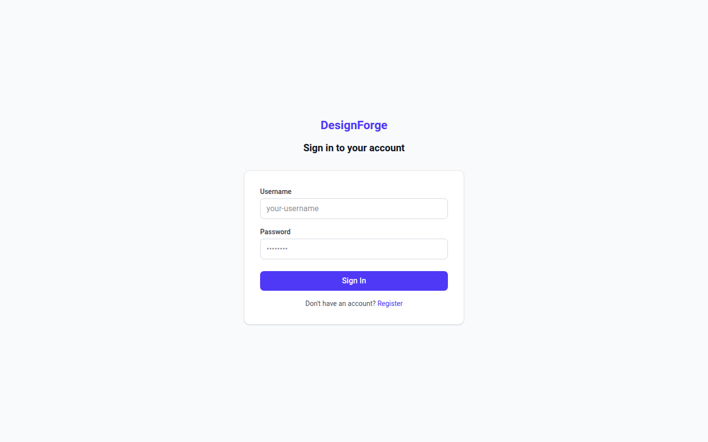

<h1 align="center">DesignForge</h1>

<p align="center">
  <strong>A self-hosted design review platform</strong><br/>
  Upload designs, pin comments directly on them, collaborate with your team — all running entirely on your own infrastructure with zero external dependencies.
</p>

<p align="center">
  <a href="#features">Features</a> &bull;
  <a href="#screenshots">Screenshots</a> &bull;
  <a href="#getting-started">Getting Started</a> &bull;
  <a href="#deployment">Deployment</a> &bull;
  <a href="#contributing">Contributing</a> &bull;
  <a href="#license">License</a>
</p>

<p align="center">
  
  
  
  
  
</p>

---

## Features

### Core
- **Design uploads** — Drag-and-drop images (PNG, JPG, GIF, SVG, WebP) or upload/write Markdown documents
- **Text-anchored comments** — Comments lock to the word you click on, surviving zoom and resolution changes. If the anchored text is deleted, the comment is automatically marked as discarded
- **Threaded replies** — Reply to comments, resolve them, or delete with confirmation
- **Design status workflow** — Track designs through Draft, In Review, and Approved stages with filter pills
- **Version history** — Upload new versions while preserving comments per-version. Browse old versions to see the review state at any point
- **Mermaid diagrams** — Render flowcharts, sequence diagrams, state diagrams, and more inside Markdown. Click the expand button to view diagrams fullscreen
- **Dark mode** — Full dark mode across all surfaces with system preference detection and manual toggle

### Shared Workspaces
- **Shared projects** — Projects are shared workspaces visible to all users. Admin creates projects, users work inside them
- **Per-user namespaces** — Each user gets an auto-created folder (named after their username) within a project. All work lives inside your own folder
- **Cross-user read-only access** — Browse other users' capability folders and view their designs read-only. Add comments and replies on anyone's designs
- **Capability folder structure** — Organize work as `username/capability/designs` with up to 3 levels of nesting below your user folder
- **Ownership enforcement** — Users can only edit, delete, move, and upload within their own folder tree. API-level and UI-level enforcement

### File Management
- **Folder rename** — Inline rename via pencil icon or double-click on folder names
- **Design move** — Move designs between folders via the 3-dot menu ("Move to...") or bulk-select multiple designs and move them at once
- **Folder picker modal** — Tree-based folder picker for choosing move destinations

### Admin
- **Admin role** — Designate an admin via `ADMIN_USERNAME` env var. Admin has exclusive access to project creation/deletion, folder management across all users, and backup/restore
- **GitHub backup/restore** — Back up the entire database (designs, comments, versions, users) to a GitHub repository with human-readable file paths (`username/project/folder/design.md` with YAML frontmatter). Supports GitHub Enterprise via configurable API URL
- **Scheduled backups** — Automatic backups via cron expression (default: daily at 2 AM)
- **Selective restore** — Full restore (wipe and rebuild) or selective (pick specific projects to import)
- **Admin page** — Dedicated `/admin` page with backup history, manual trigger, restore controls, and configuration display

### AI Agent Integration (v2)
- **GitHub Markdown Scraper** — Scrape all `.md` files from GitHub orgs/users into DesignForge. Multi-target support, per-repo branch selection, configurable cron schedule (default: every 12 hours), auto-generated index for fast lookups. Supports GitHub Enterprise
- **dfcli — CLI for AI Agents** — Standalone CLI tool (`dfcli pull`, `dfcli upload`, `dfcli related`) that AI coding agents use to load context from DesignForge. Finds semantically related docs via TF-IDF similarity, including scraped GitHub content
- **Document Similarity Engine** — Hybrid TF-IDF engine computes relationships between all markdown designs in a project. Document-level + chunk-level (by heading) scoring with optional local embeddings via all-MiniLM-L6-v2
- **API Token Auth** — Generate Bearer tokens at `/settings/tokens` for machine access. Multiple tokens per user, SHA-256 hashed at rest
- **Claude Code Skill** — Built-in skill (`.claude/skills/designforge.md`) that agents invoke to auto-fetch related design docs and scraped GitHub documentation into their context window
- **Folder Breadcrumbs** — Design viewer and related designs show clickable folder paths for origin tracking

### Collaboration
- **Shareable links** — Generate share links with optional password protection and expiry dates
- **Export** — Export designs as Markdown, HTML, Word, or Confluence markup with rich comment context
- **Configurable base path** — Deploy under any sub-path (e.g. `/design`) for reverse proxy setups
- **Fully local** — No external API calls, no CDNs, no analytics, no telemetry. Uses local SQLite, local file storage, and system fonts

## Screenshots

### Project Dashboard
All projects visible to all users, with creator labels. Admin sees the "New Project" button.



### Capability Folders
Click a user folder to see their capability folders as navigable cards.



### Design Viewer with Comments
Pin comments on any word in your markdown documents. Mermaid diagrams render inline with an expand button.



### Dark Mode
Full dark mode support across all surfaces, toggleable from the header.



### Admin Backup & Restore
Admin page with backup history, manual trigger, restore controls, and GitHub configuration.



### Login
Clean authentication with username/password. No external auth providers needed.



## Tech Stack

| Layer | Technology |
|---|---|
| **Framework** | [Next.js 16](https://nextjs.org/) (App Router) |
| **Language** | TypeScript 5 |
| **Database** | SQLite via [Prisma ORM](https://www.prisma.io/) |
| **Auth** | [NextAuth.js v5](https://authjs.dev/) with credentials provider (bcryptjs) |
| **Styling** | [Tailwind CSS v4](https://tailwindcss.com/) with [@tailwindcss/typography](https://github.com/tailwindlabs/tailwindcss-typography) |
| **Markdown** | [react-markdown](https://github.com/remarkjs/react-markdown) + remark-gfm + rehype-slug |
| **Diagrams** | [Mermaid](https://mermaid.js.org/) (client-side rendering + server-side SVG export via mmdc) |
| **Backup** | GitHub REST API (Git Trees API) with [gray-matter](https://github.com/jonschlinkert/gray-matter) for YAML frontmatter |
| **Scheduler** | [node-cron](https://github.com/node-cron/node-cron) via Next.js instrumentation hook |
| **File storage** | Local `uploads/` directory |
| **Export** | marked (HTML), docx (Word), Confluence storage format |

## Getting Started

### Prerequisites

- Node.js 18+ (20+ recommended)
- npm

### Quick Start

```bash
# Clone the repository
git clone https://github.com/claptrap251/DesignForge.git
cd DesignForge

# Install dependencies
npm install

# Set up environment variables
cp .env.example .env
# Edit .env and set NEXTAUTH_SECRET to a random string
# Set ADMIN_USERNAME to your desired admin username

# Initialize the database
npx prisma db push

# Start the dev server
npm run dev
```

Open [http://localhost:3000](http://localhost:3000) and register your first account. If your username matches `ADMIN_USERNAME`, you'll have admin access to create projects and manage backups.

### Environment Variables

| Variable | Description | Default |
|---|---|---|
| `DATABASE_URL` | SQLite database path | `file:./dev.db` |
| `NEXTAUTH_SECRET` | Session encryption key (required) | — |
| `NEXTAUTH_URL` | App origin URL | `http://localhost:3000` |
| `AUTH_TRUST_HOST` | Trust the host header | `true` |
| `UPLOAD_DIR` | Directory for uploaded files | `./uploads` |
| `NEXT_PUBLIC_BASE_PATH` | Serve under a sub-path (e.g. `/design`) | — |
| `NEXT_TELEMETRY_DISABLED` | Disable Next.js telemetry | `1` |
| `ALLOWED_DEV_ORIGINS` | Comma-separated dev origins for remote access | — |
| `ADMIN_USERNAME` | Username with admin privileges | — |
| `ENCRYPTION_KEY` | Encryption key for tokens stored in DB (falls back to `NEXTAUTH_SECRET`) | — |
| `GITHUB_BACKUP_*` | Legacy backup env vars — auto-migrated to DB on first startup | — |

## Deployment

### Production Build

```bash
npm run build
npm start
```

### Docker

```bash
docker compose up --build -d
```

The included `Dockerfile` builds a standalone Next.js image with Chromium for server-side mermaid diagram rendering.

### Reverse Proxy (Sub-path)

To serve DesignForge at `https://your-domain.com/design`:

1. Set `NEXT_PUBLIC_BASE_PATH="/design"` in `.env`
2. Rebuild: `npm run build`
3. Configure your reverse proxy to forward `/design` to the app

> **Note:** `NEXT_PUBLIC_BASE_PATH` is baked into the client bundle at build time. Changing it requires a rebuild.

## Project Structure

```
src/
├── app/
│   ├── admin/               # Admin backup/restore page
│   ├── api/
│   │   ├── admin/           # Backup, restore, config, admin check
│   │   │   └── scraper/     # GitHub scraper config, repos, branches, run, history
│   │   ├── cli/             # CLI endpoints: files, projects, related search
│   │   ├── tokens/          # API token management (generate, list, revoke)
│   │   ├── designs/         # Design CRUD + versioning + export + move
│   │   ├── comments/        # Comment CRUD + replies
│   │   ├── projects/        # Project CRUD (admin-only create/delete)
│   │   ├── folders/         # Folder CRUD with ownership checks
│   │   ├── share/           # Share link management
│   │   ├── export/          # Project-level export
│   │   ├── uploads/         # Static file serving
│   │   └── auth/            # Registration + NextAuth
│   ├── project/[projectId]/
│   │   └── design/[designId]/  # Design viewer with comments
│   ├── share/[token]/       # Public shared view
│   └── dashboard/           # Project listing
├── components/
│   ├── design/              # ImageViewer, MarkdownViewer, VersionHistory,
│   │                        # DesignCard, DesignGrid, FolderPickerModal
│   ├── comments/            # PinLayer, CommentSidebar, CommentThread
│   ├── layout/              # Header, Sidebar, ThemeProvider
│   ├── project/             # ProjectCard, CreateProjectDialog
│   ├── share/               # ShareDialog, PasswordGate
│   └── export/              # ExportDialog
├── lib/
│   ├── auth.ts              # NextAuth configuration
│   ├── admin.ts             # Admin check + backup config helpers
│   ├── ownership.ts         # Folder/design ownership resolution
│   ├── migration.ts         # One-time data migration for shared projects
│   ├── db.ts                # Prisma client
│   ├── basePath.ts          # Base path helper for API/navigation URLs
│   ├── clipboard.ts         # Clipboard with fallback for non-HTTPS
│   ├── anchor.ts            # Comment anchor computation
│   ├── crypto.ts            # AES-256-GCM encrypt/decrypt for stored tokens
│   ├── similarity.ts        # TF-IDF similarity engine for document relationships
│   ├── backup/
│   │   ├── github.ts        # GitHub API client (supports enterprise)
│   │   ├── serialize.ts     # DB to file tree serialization
│   │   ├── deserialize.ts   # File tree to DB restore
│   │   └── scheduler.ts     # Cron-based backup scheduling
│   ├── scraper/
│   │   ├── github.ts        # GitHubScraper client (multi-repo, read-only)
│   │   ├── engine.ts        # Scrape orchestrator (folder creation, design upsert)
│   │   └── scheduler.ts     # Per-target cron registration
│   └── export/              # Confluence, HTML, Markdown, Word exporters
├── instrumentation.ts       # Startup: cron scheduler + migrations
├── .claude/skills/          # Claude Code skill for AI agent context loading
├── cli/                     # dfcli — standalone CLI for AI agents
└── prisma/
    └── schema.prisma        # Database schema
```

## How It Works

### Shared Workspaces

Projects are shared workspaces. Only admins can create or delete projects. When a user opens a project for the first time, a folder named after their username is automatically created. Users work exclusively within their own folder:

```
Project: "Mobile App Redesign"
├── alice/                    ← auto-created, owned by alice
│   ├── Login Flow/           ← capability folder
│   │   ├── wireframe.md
│   │   └── Iterations/       ← up to 3 levels deep
│   │       └── v2-revised.md
│   └── Checkout/
│       └── checkout-flow.md
├── bob/                      ← auto-created, owned by bob
│   └── Settings/
│       └── settings-spec.md
```

Users can browse other users' folders read-only and add comments, but cannot edit, delete, or move other users' content. Admins can delete any folder.

### Comment Anchoring

DesignForge uses a hybrid anchoring system:

1. **Text anchoring** (markdown) — When you click to add a comment, the system captures the word at the click point. This text anchor survives zoom, resolution, and layout changes.
2. **Coordinate fallback** — Click position stored as `(xPercent, yPercent)` for image designs.
3. **Auto-discard** — When content is updated, comments whose anchored text no longer exists are automatically marked as "Discarded". If the text reappears, comments are un-discarded.
4. **Version-aware** — Comments are locked to the version they were created on.

### GitHub Backup Format

Backups use a human-readable file tree with YAML frontmatter:

```yaml
# alice/Mobile App/Login Flow/wireframe.md
---
id: clx1abc123
status: IN_REVIEW
currentVersion: 2
versions:
  - version: 1
    changeNote: "Initial draft"
comments:
  - pin: 1
    author: bob
    content: "Button too small"
    anchorLine: 12
    resolved: false
---
# Login Wireframe
The user lands on the login page...
```

The manifest (`_manifest.json`) includes SHA-256 content hashes for future duplicate detection and cross-reference mapping.

## Contributing

Contributions are welcome! Please:

1. Fork the repository
2. Create a feature branch (`git checkout -b feature/amazing-feature`)
3. Commit your changes (`git commit -m 'Add amazing feature'`)
4. Push to the branch (`git push origin feature/amazing-feature`)
5. Open a Pull Request

### Development

```bash
npm run dev          # Start dev server
npm test             # Run tests
npx tsc --noEmit     # Type check
npm run build        # Production build
npx prisma studio    # Browse database
```

## License

This project is licensed under the MIT License — see the [LICENSE](LICENSE) file for details.

## Acknowledgments

- Built with [Next.js](https://nextjs.org/), [Prisma](https://www.prisma.io/), and [Tailwind CSS](https://tailwindcss.com/)
- Markdown rendering by [react-markdown](https://github.com/remarkjs/react-markdown)
- Diagram support by [Mermaid](https://mermaid.js.org/)
- YAML frontmatter by [gray-matter](https://github.com/jonschlinkert/gray-matter)
